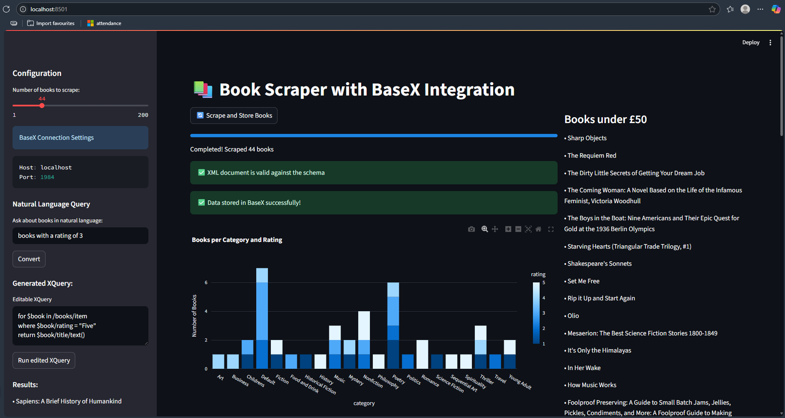
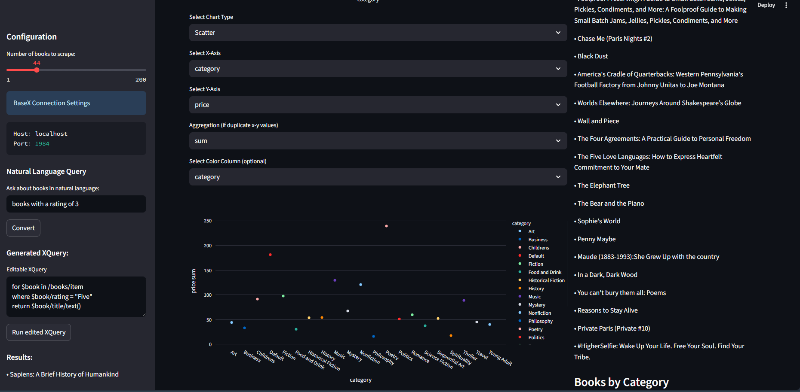

# 📚 Web2XML: Structured Book Metadata Extraction and Query System

**Requirements (tested on):**
1. Java v11
2. BaseX v11.9
3. Python v3.12

---

**Description:**

**Web2XML** is a full-stack text technology pipeline that scrapes book data from the web, converts it into structured XML, validates it against a RelaxNG schema, stores it in the XBase XML-native database, and enables querying via XQuery with an optional natural language interface powered by a Large Language Model (LLM).

---

## 🚀 Features

- Scrapes live book data from [books.toscrape.com](https://books.toscrape.com)
- Converts scraped data into well-formed XML using `dicttoxml`
- Validates XML with a custom **RelaxNG** schema
- Stores data in **XBase** (BaseX) XML database
- Enables querying via **XPath** / **XQuery**
- Natural language to XQuery conversion using **few-shot LLM prompts**
- Sample query execution and results display in **Streamlit**
- Interactive visualizations (e.g., books per category)

---

## 🛠️ Technologies Used

-**Python** (BeautifulSoup, Requests, lxml, Streamlit)

-**XML + RelaxNG**

-**BaseX** (XBase XML-native DB)

-**XQuery / XPath**

-**XSLT (for future styling)**

-**LLM**(Hugging Face LLM for query generation)

---

## ⚙️ How to Run

1.**Install Dependencies**

```bash
  pip install -r requirements.txt
```

2.**Start BaseX Server**

  Ensure [BaseX](https://basex.org/download/) is running locally on port `1984`.

  If running first time, ensure to set basex password:

```
basexhttp -c "PASSWORD admin"
```

 **or** update your password under basex_conn.py

3.**Launch the Streamlit App**

```bash
python -m streamlit run .\main.py
```

4.**Use the Sidebar**

- Select number of books to scrape.
- Optionally enter a natural language query (e.g., "books under £15").

5. A free tier token is already present under book_scraper.py to make use of LLM

---

## 💡 Example Natural Language Queries

-`Books under £20`

-`Top rated books`

-`Count of books in each category`

---


# GUI





- Select number of books to scrape
- Verify schema validation and database action
- Select different visualization types and axis to visualize data according to need
- Give in natural language query related to database and run
- Edit generated xquery to modify your needs
---

## 🧠 Known Limitations

- LLM prompt context is restricted due to token limitations on free API tier.
- Scope is limited to predefined XML structure and query types.
- Query sandbox is provided for manual correction of generated XQuery.

---

## 👥 Authors

- Amogh Mathad
- A Yogi Athish
- Atharva Bapat
